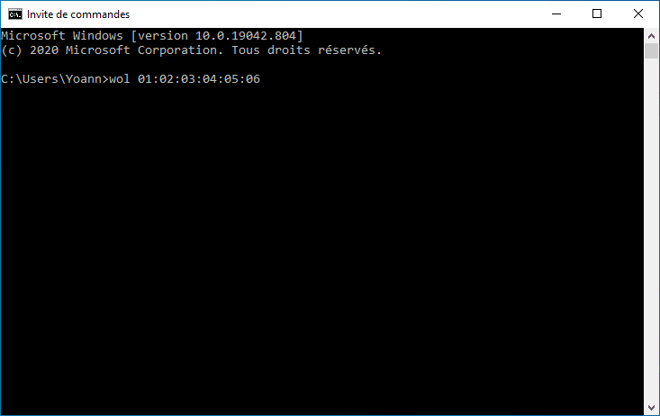

# wol
Windows command-line utility for remotely waking up computers by sending magic packets over the network

```
Usage : wol.exe [<macaddress> <macaddress>] [-f <filename>] [-i <ipaddress>] [-p <port>]

<macaddress> : MAC addresses to wake up (multiple MAC addresses allowed)
-f <filename>, --file=<filename> : A Text file containing MAC addresses to wake up (one MAC address per line)
-i <ipaddress>, --ip=<ipaddress> : The Destination IP address, usually a broadcast address (default : 255.255.255.255)
-p <port>, --port=<port>: The destination UDP port number, usually 7 or 9 (default : 9)
-h, --help : Print this help screen
-v, --version : Print the version of the program and exit
```

This program have been created by Yoann LAMY under the terms of the [GNU General Public License v3](http://www.gnu.org/licenses/gpl.html).



CREDITS :
Portions of this program are Copyright (c) 1993 - 2018, Chad Z. Hower (Kudzu) and the Indy Pit Crew - [http://www.indyproject.org/](https://www.indyproject.org/).
